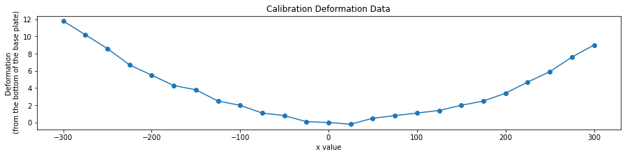

# Deformation

## List of Files

|File Name| Description|
|:---|:---|
|[DeformationMapsCal.xlsx](https://github.com/SRP-AM/SRP_AM_Prediction_Challenge/blob/main/Deformation/CalTask/DeformationMapsCal.xlsx)|Deformation map for the calibration task|
|[DeformationMapsChallDataRemoved.xlsx](https://github.com/SRP-AM/SRP_AM_Prediction_Challenge/blob/main/Deformation/ChallTask/DeformationMapsChallDataRemoved.xlsx)|Deformation map for the challenge task. Empty file to be filled and returned|

## Data Visualization
In the code below we visualize the calibration deformation measurements included in DeformationMapsCal.xlsx.
A visual is also generated within the xlsx file itself.


```python
import pandas as pd
from matplotlib import pyplot as plt
import numpy as np

cal_def = pd.read_excel('CalTask/DeformationMapsCal.xlsx')

plt.figure(figsize=(15, 3))
plt.plot(cal_def['X (distance from left end)'], cal_def['Deformation'])
plt.scatter(cal_def['X (distance from left end)'], cal_def['Deformation'])
plt.xlabel('x value')
plt.ylabel('Deformation\n (from the bottom of the base plate)')
plt.title('Calibration Deformation Data')
plt.show()
```



