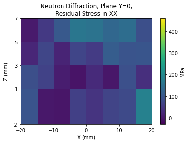
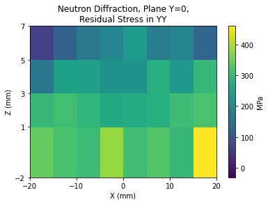
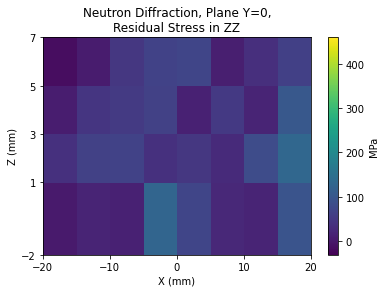
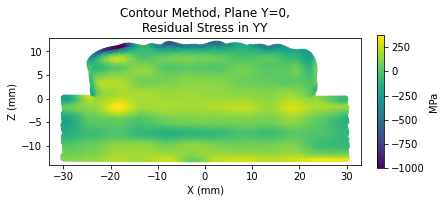

# Residual Stress Data

## List of Files

|File Name| Description|
|:---|:---|
|[ORNL_MBAAM_Challenge_Residual_Stress_Results_VF.pptx](https://github.com/SRP-AM/SRP_AM_Prediction_Challenge/blob/main/ResidualStress/ORNL_MBAAM_Challenge_Residual_Stress_Results_VF.pptx)|Document explaining how residual stress was measured|
|[CalTask/ResidualStress_calibrationsample.xlsx](https://github.com/SRP-AM/SRP_AM_Prediction_Challenge/blob/main/ResidualStress/CalTask/Residual%20Stress%20_calibration%20sample.xlsx)|Residual stress data for the calibration task.|
|[CalTask/WAAM results revBLB.xlsx](https://github.com/SRP-AM/SRP_AM_Prediction_Challenge/blob/main/ResidualStress/CalTask/WAAM%20Results%20revBLB.xlsx)|Additional strain/stress information|
|[ChallTask/ResidualStress_challengesample_template.xlsx](https://github.com/SRP-AM/SRP_AM_Prediction_Challenge/blob/main/ResidualStress/ChallTask/Residual%20Stress%20_challenge%20sample_template.xlsx)|Challenge task spreadsheet residual stress template to be filled–locations only.|

## CalTask/ResidualStress_calibrationsample.xlsx

The residual stress data for the calibration task is contained in Residual Stress _calibration sample.xlsx.
For more information on the residual stress calibration task, please see section 2.3.3 of the [challenge information packet](https://github.com/SRP-AM/SRP_AM_Prediction_Challenge/blob/main/challenge_info_packet.pdf) or ["Residual Stress Data"](https://github.com/SRP-AM/SRP_AM_Prediction_Challenge/wiki/Calibration-Problem-Data#residual-stress-data) in the wiki.

This dataset is split into multiple spreadsheet tabs as follows:

1.  Calibration Central (Y=0)_ND
2.  Calibration Central (Y=0)_Cont
3.  Calibration left (Y=-125)_ND
4.  Calibration left(Y=-125)_Cont
5.  Calibration right(Y=125)_ND
6.  Calibration RS Locations

Here ND indicates data extracted via neutron diffraction and Cont indicates data extracted via the contour method.

### _ND tab structure
For the neutron diffraction data, we have the following column structure:

-  ***Column 1, X(mm)***: Integer data, the X position in mm. Measurements were taken in intervals of 5 mm between -20 and 20mm.
-  ***Column 2, Y(mm)***: Integer data, the Y position in mm. This value is constant, since each page in the document corresponds to a single Y plane.
-  ***Column 3, Z(mm)***: Integer data, the Z position in mm. Measurements were taken at the following points: $Z \in \{-2, 1, 3, 5, 7\}$.
-  ***Column 4, Sigma XX (MPA)***: Continuous data, the measured residual stress in the X direction, taken in megapascals.
-  ***Column 5, Sigma YY (MPA)***: Continuous data, the measured residual stress in the Y direction, taken in megapascals.
-  ***Column 6, Sigma ZZ (MPA)***: Continuous data, the measured residual stress in the Z direction, taken in megapascals.  

### _Cont tab structure
For the contour method data, we have the following column structure:
-  ***Column 1, X(mm)***: Continuous data, the X position in mm. Not limited to a few integer measurements, taken through the entire thickness of the plate.
-  ***Column 2, Y(mm)***: Continuous data, the Y position in mm. This value is constant, as in the neutron diffraction data.
-  ***Column 3, Z(mm)***: Continuous data, the Z position in mm. Not limited to a few integer measurements, taken through the entire thickness of the plate.
-  ***Column 4, Sigma YY (MPA)***: Continuous data, the measured residual stress in the Y direction, taken in megapascals.  


The final tab in the file--Calibration RS Locations--provides a template for reporting the calculated residual stress problem for the calibration problem

## Quickstart Visualization


```python
import pandas as pd
from matplotlib import pyplot as plt
import numpy as np
```

### Neutron Diffraction Visualization


```python
Cal_ND_Y0 = pd.read_excel('CalTask/Residual Stress _calibration sample.xlsx', 'Calibration central (Y=0)_ND')

Cal_ND_Y0_arr = np.array(Cal_ND_Y0)

NDX0 = np.array(Cal_ND_Y0_arr[:,0]).reshape(5,9)
NDZ0 = np.array(Cal_ND_Y0_arr[:,2]).reshape(5,9)
NDXX0 = np.array(Cal_ND_Y0_arr[:,3]).reshape(5,9)
NDYY0 = np.array(Cal_ND_Y0_arr[:,4]).reshape(5,9)
NDZZ0 = np.array(Cal_ND_Y0_arr[:,5]).reshape(5,9)

max_stress = np.max(Cal_ND_Y0_arr[:,-3:])
min_stress = np.min(Cal_ND_Y0_arr[:,-3:])

for axis_name, axis_data in [('XX', NDXX0), ('YY', NDYY0), ('ZZ', NDZZ0)]:
    plt.pcolormesh(NDX0, NDZ0, axis_data, vmin = min_stress, vmax=max_stress)
    plt.colorbar(label='MPa')
    plt.xlabel('X (mm)')
    plt.ylabel('Z (mm)')
    plt.yticks(NDZ0[:,1])
    plt.xticks([-20, -10, 0, 10, 20])
    plt.title('Neutron Diffraction, Plane Y=0,\nResidual Stress in '+ axis_name)
    plt.savefig('Cal_NDY0' + axis_name + '.jpg')
    plt.show()
```

    <ipython-input-3-495c190ae14b>:15: MatplotlibDeprecationWarning: shading='flat' when X and Y have the same dimensions as C is deprecated since 3.3.  Either specify the corners of the quadrilaterals with X and Y, or pass shading='auto', 'nearest' or 'gouraud', or set rcParams['pcolor.shading'].  This will become an error two minor releases later.
      plt.pcolormesh(NDX0, NDZ0, axis_data, vmin = min_stress, vmax=max_stress)











### Contour Method Visualization


```python
Cal_Cont_Y0 = pd.read_excel('CalTask/Residual Stress _calibration sample.xlsx', 'Calibration central (Y=0)_Cont')
Cal_Cont_Y0_arr = np.array(Cal_Cont_Y0)

ContX0 = np.array(Cal_Cont_Y0_arr[:,0])
ContZ0 = np.array(Cal_Cont_Y0_arr[:,2])
ContYY0 = np.array(Cal_Cont_Y0_arr[:,3])

max_stress_Cont = np.max(Cal_Cont_Y0_arr[:,-3])
min_stress_Cont = np.min(Cal_Cont_Y0_arr[:,3])

fig = plt.figure()
ax = fig.add_subplot(111)

ax.scatter(ContX0, ContZ0, c=ContYY0, marker='h')
im = ax.scatter(ContX0, ContZ0, c=ContYY0, marker='o', s=5)
ax.set_xlabel('X (mm)')
ax.set_ylabel('Z (mm)')
ax.set_title('Contour Method, Plane Y=0,\nResidual Stress in YY')
ax.set_aspect('equal')
cbar = plt.colorbar(im, orientation='vertical', label='MPa', fraction=0.02)
plt.savefig('Cal_ContY0YY.png', bbox_inches='tight')
plt.show()
```





```python

```
